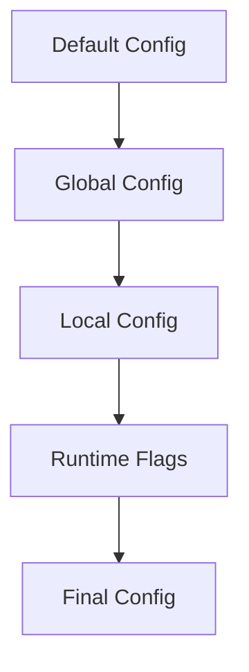
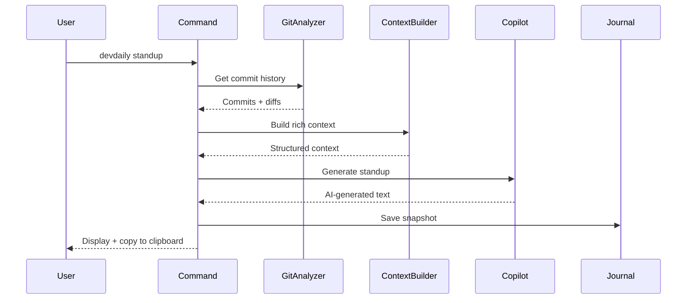

## Tech Stack

DevDaily is built with modern TypeScript and Node.js tooling:

<CardGroup cols={2}>
  <Card title="Language" icon="code">
    **TypeScript 5.7** with strict mode enabled
  </Card>
  <Card title="Runtime" icon="node">
    **Node.js 18+** with ESM (ECMAScript Modules)
  </Card>
  <Card title="CLI Framework" icon="terminal">
    **Commander.js 12** for command parsing
  </Card>
  <Card title="Build Tool" icon="box">
    **tsup** for fast bundling
  </Card>
</CardGroup>

### Core Dependencies

| Category | Technology | Purpose |
|----------|------------|----------|
| **Git Operations** | [simple-git](https://github.com/steveukx/git-js) | Git history analysis and operations |
| **AI Generation** | GitHub Copilot CLI | AI-powered text generation |
| **Terminal UI** | chalk, boxen, ora, inquirer | Rich CLI interface |
| **Validation** | Zod | Schema validation and config parsing |
| **Testing** | Vitest | Fast unit testing |
| **Linting** | ESLint + Prettier | Code quality and formatting |
| **Commit Hooks** | Husky + commitlint | Conventional commits enforcement |

## Project Structure

The codebase follows a clean separation of concerns:

```
devdaily/
├── src/
│   ├── commands/          # CLI command handlers
│   ├── core/              # Business logic
│   ├── config/            # Configuration management
│   ├── ui/                # Terminal UI components
│   ├── utils/             # Shared utilities
│   ├── types/             # TypeScript definitions
│   └── index.ts           # CLI entry point
├── tests/                 # Vitest test suites
├── schemas/               # JSON Schema for autocomplete
├── examples/              # Example outputs
└── docs/                  # Additional documentation
```

### Commands Layer

<Accordion title="src/commands/">
  CLI command handlers that orchestrate business logic. Commands should be thin - they parse arguments, call core modules, and handle output.

  **Files:**
  - `standup.ts` - Standup generation
  - `pr.ts` - PR description generation
  - `week.ts` - Weekly summary
  - `context.ts` - Context recovery
  - `recall.ts` - Work history search
  - `snapshot.ts` - Manual snapshot capture
  - `init.ts` - Setup wizard
  - `config.ts` - Configuration management
  - `doctor.ts` - System diagnostics
  - `connect.ts` - PM tool connection
  - `dash.ts` - Interactive dashboard
</Accordion>

### Core Layer

<Accordion title="src/core/">
  Business logic and domain models. This is where the main functionality lives.

  **Key Modules:**
  - `git-analyzer.ts` - Git operations using simple-git
  - `copilot.ts` - GitHub Copilot CLI integration
  - `standup-context.ts` - Rich context builder for standups
  - `context-analyzer.ts` - Work pattern analysis
  - `snapshot-builder.ts` - Snapshot creation
  - `work-journal.ts` - Persistent local storage
  - `auto-snapshot.ts` - Side-effect & hook snapshots
  - `notifications.ts` - Slack/Discord webhooks
  - `project-management.ts` - Jira/Linear/GitHub Issues
  - `pr-template.ts` - PR template detection
  - `pr-prompt.ts` - Custom prompt file loader
  - `github.ts` - GitHub API helpers
  - `github-repo.ts` - Repo metadata extraction
</Accordion>

### Configuration Layer

<Accordion title="src/config/">
  Configuration loading and validation using Zod schemas.

  **Features:**
  - Hierarchical config (local overrides global)
  - Separate secrets management
  - JSON Schema generation for IDE autocomplete
  - Type-safe configuration access
</Accordion>

### UI Layer

<Accordion title="src/ui/">
  Terminal UI components for rich CLI output.

  **Components:**
  - `colors.ts` - Color scheme and styling
  - `renderer.ts` - Output formatting
  - `help.ts` - Help screens
  - `ascii.ts` - ASCII art and banners
  - `dashboard.ts` - Interactive dashboard
  - `keyboard.ts` - Keyboard input handling
</Accordion>

### Utilities Layer

<Accordion title="src/utils/">
  Shared helper functions and utilities.

  **Utilities:**
  - `formatter.ts` - Text and markdown formatting
  - `helpers.ts` - General helper functions
  - `commitlint.ts` - Conventional commit parsing
  - `ui.ts` - UI helper functions
</Accordion>

## Architecture Patterns

### Dependency Flow

<Steps>
  <Step title="CLI Entry Point">
    `src/index.ts` initializes Commander.js and registers all commands
  </Step>
  <Step title="Command Handlers">
    Commands in `src/commands/` parse arguments and orchestrate logic
  </Step>
  <Step title="Core Logic">
    Business logic in `src/core/` executes the actual work
  </Step>
  <Step title="UI & Output">
    Results are formatted and displayed via `src/ui/` components
  </Step>
</Steps>

<Info>
  **Design Principle:** Commands should be thin orchestrators. Keep business logic in the `core/` layer for better testability and reusability.
</Info>

### File Organization

<CodeGroup>
```typescript One export per file
// src/core/copilot.ts
export async function generateWithCopilot(prompt: string): Promise<string> {
  // Implementation
}
```

```typescript Co-located tests
// tests/copilot.test.ts
import { generateWithCopilot } from '../src/core/copilot.js';

describe('generateWithCopilot', () => {
  it('generates text from prompt', async () => {
    // Test implementation
  });
});
```
</CodeGroup>

### Configuration Hierarchy

DevDaily supports multiple configuration layers:



| Scope | Path | Priority |
|-------|------|----------|
| Default | Hardcoded | Lowest |
| Global | `~/.config/devdaily/config.json` | Low |
| Local | `.devdaily.json` | High |
| Runtime | CLI flags (e.g., `--format`) | Highest |

<Warning>
  **Secrets** should always be stored separately in `.devdaily.secrets.json` or `~/.config/devdaily/secrets.json` and never committed to version control.
</Warning>

## Data Flow

### Standup Generation Flow



### Work Journal System

The journal system provides persistent memory across commands:

<Steps>
  <Step title="Snapshot Capture">
    Triggered automatically after commands or manually via `devdaily snapshot`
  </Step>
  <Step title="Local Storage">
    Snapshots stored in `~/.config/devdaily/journal/` as JSON files
  </Step>
  <Step title="Indexing">
    Snapshots indexed by date, project, branch, and tags
  </Step>
  <Step title="Retrieval">
    Searched via `devdaily recall` or aggregated for weekly summaries
  </Step>
</Steps>

## TypeScript Configuration

The project uses **strict mode** with comprehensive checks:

<CodeGroup>
```json tsconfig.json
{
  "compilerOptions": {
    "target": "ES2022",
    "module": "ESNext",
    "moduleResolution": "bundler",
    "strict": true,
    "noImplicitAny": true,
    "strictNullChecks": true,
    "noUnusedLocals": true,
    "noUnusedParameters": true,
    "noImplicitReturns": true
  }
}
```

```typescript tsup.config.ts
import { defineConfig } from 'tsup';

export default defineConfig({
  entry: ['src/index.ts'],
  format: ['esm'],
  dts: true,
  splitting: false,
  sourcemap: true,
  clean: true,
  shims: true,
  banner: {
    js: '#!/usr/bin/env node',
  },
});
```
</CodeGroup>

<Tip>
  The `#!/usr/bin/env node` shebang is added by tsup to make the output executable as a CLI tool.
</Tip>

## Build Process

### Development Build

```bash
npm run dev  # Watch mode with tsx
```

- Uses `tsx` for fast TypeScript execution
- Auto-rebuilds on file changes
- No bundling required

### Production Build

```bash
npm run build  # tsup bundler
```

- Bundles to single ESM file in `dist/`
- Generates type declarations (`.d.ts`)
- Includes source maps
- Adds shebang for CLI execution

## Next Steps

<CardGroup cols={2}>
  <Card title="Setup Guide" icon="wrench" href="/development/setup">
    Set up your development environment
  </Card>
  <Card title="Testing" icon="flask" href="/development/testing">
    Learn about the testing approach
  </Card>
  <Card title="Contributing" icon="code-pull-request" href="/development/contributing">
    Submit your first contribution
  </Card>
</CardGroup>
